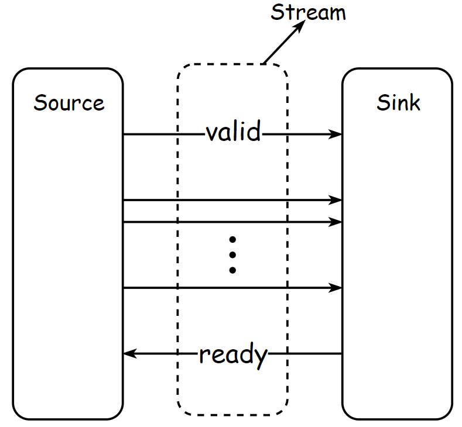
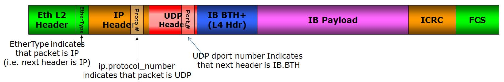
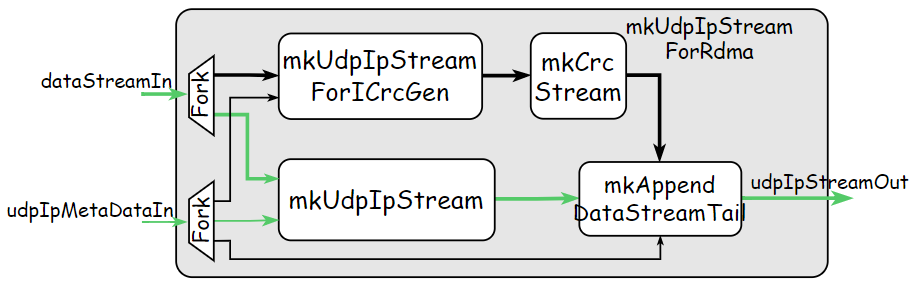
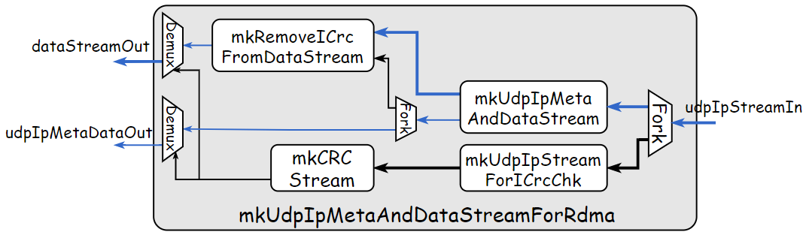
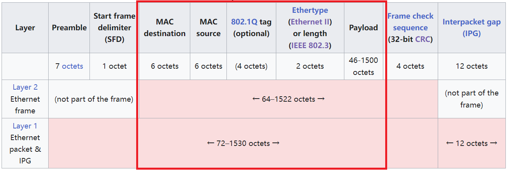
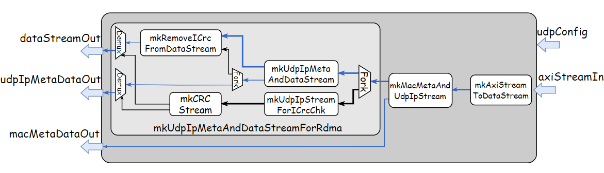
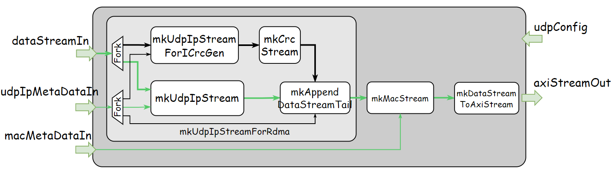
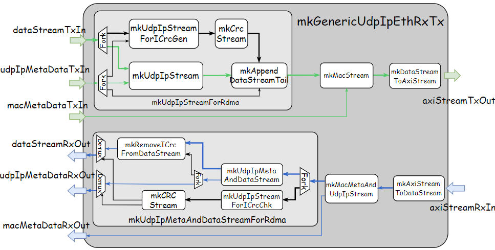

# Intro

This repo implements a collection of hardware components in Bluespec SystemVerilog(BSV) for high-performance processing of [UDP](https://en.wikipedia.org/wiki/User_Datagram_Protocol) packets on FPGA. Specifically, this repo provides modules for generating and parsing [UDP](https://en.wikipedia.org/wiki/User_Datagram_Protocol)/[IP](https://en.wikipedia.org/wiki/Internet_Protocol)/[Ethernet](https://en.wikipedia.org/wiki/Ethernet_frame) packets. Beside building a standard UDP/IP/Ethernet stack, blue-udp also supports RoCE(RDMA over Converged Ethernet) by integrating the generation and verification of ICRC(Invariant Cyclic Redundancy) into packet processing logic;

# Directories Overview

Some key directories of this repo are introduced below:
```bash
├── fpga              # On-board FPGA verification projects
├── lib               # external libraries/repos
│   ├── blue-crc      # high-performance CRC hardware implementation
│   └── blue-wrapper  # BSV wrappers for generating ready-to-use Verilog interface
├── README.md         # readme document
├── run.sh            # main running script of CI
├── setup.sh          # environment setup script of CI
├── scripts           # scripts used to build project
├── src               # design source files
│   └──includes       # files containing some commonly-used BSV types and modules
└── test              # source files for verification
    ├── bluesim       # testbenches based on bluesim
    ├── cocotb        # python testbenches based on cocotb
    └── vivado        # co-simulation with cmac using vivado
```

Here is a list of core source files under `./src` directory:

```bash
./src
├── includes                   
│   ├── CompletionBuf.bsv      
│   ├── ContentAddressMem.bsv  
│   ├── EthernetTypes.bsv       # numeric and struct types about protocol definition
│   ├── PortConversion.bsv      # interface conversion modules used to generate ready-to-use Verilog
│   ├── Ports.bsv               # numeric and struct types about in/output ports of modules
│   ├── RFile.bsv
│   ├── StreamHandler.bsv       # modules implemented for manipulating data stream
│   ├── XilinxAxiStreamAsyncFifo.bsv # wrappers of Xilinx asynchronous fifo
│   └── EthUtils.bsv            # utility functions and modules
├── MacLayer.bsv                # generator and parser for Ethernet packet
├── UdpIpEthCmacRxTx.bsv        # UDP/IP/Ethernet packet transceiver with CMAC controller 
├── UdpIpEthRx.bsv              # UDP/IP/Ethernet packet receiver
├── UdpIpEthTx.bsv              # UDP/IP/Ethernet packet transmitter
├── UdpIpEthBypassCmacRxTx.bsv  # UDP/IP/Ethernet transceiver with bypass channel and CMAC controller
├── UdpIpEthBypassRx.bsv        # UDP/IP/Ethernet packet receiver with bypass channel
├── UdpIpEthBypassTx.bsv        # UDP/IP/Ethernet packet transmitter with bypass channel
├── UdpIpLayer.bsv              # parser and generator for UDP/IP packet
├── UdpIpLayerForRdma.bsv       # parser and generator for UDP/IP packet with support for RoCE
└── XilinxCmacController.bsv    # controller for Xilinx CMAC IP
```

# Components

This section provides detailed descriptions of some important components implemented in blue-udp, including their functionality, interface and hardware architecture.

## StreamHandler
What Ethernet-related hardware components do is basically a series of stream manipulations. The packet generator is responsible for inserting the header stream into the head of payload stream to generate complete packet stream. On the contrary, what the parser does is to extract the header stream and payload stream from packet stream. As for adding the checksum for a packet, the packet stream is passed into CRC calculator and then the output CRC value is appended to the tail of the packet stream.

The hardware entity corresponding to the stream we mention here is actually a group of data signals guarded by the valid-ready control signal pair. The valid signal indicates that  the source component wants to transfer data. And the ready indicates that the sink is ready to receive data from source. A transfer between source and sink only happens successfully when both valid and ready are high. If the size of data to be transmitted is larger than the size of one transfer, the data needs to be fragmented and transmitted in a series of transfers.

<div align=center></div>

The most tricky and error-prone part of stream processing is about how to handle the valid-ready control signals of different streams. In BSV, the manipulation of control signals is implemented by the compiler and invisible in the grammatical level, which helps designers focus on the logic of stream processing.

<details>
<summary>The stream processing modules provided in blue-udp include:</summary>

Data signals used to transfer packet stream between different components are encapsulated in **DataStream** struct, which includes 256-bit data signal, 32-bit byte-enable signal, two Boolean signals represents whether this transfer is the last or first of a packet stream.

```bluespec
typedef 256 DATA_BUS_WIDTH;
typedef TDiv#(DATA_BUS_WIDTH, 8) DATA_BUS_BYTE_WIDTH;
typedef Bit#(DATA_BUS_WIDTH) Data;
typedef Bit#(DATA_BUS_BYTE_WIDTH) ByteEn;
typedef struct {
    Data data;
    ByteEn byteEn;
    Bool isFirst;
    Bool isLast;
} DataStream deriving(Bits, Bounded, Eq, FShow);
```

- **mkAppendDataStreamHead** appends one transfer in **appendDataIn** stream to the head of one packet in **dataStreamIn** stream. The endian of data from these two streams can be swapped by setting **swapDataStream** and **swapAppendData** parameters. This module is used to combine header stream and payload stream to generate complete UDP/IP/Ethernet packet.

```bluespec
module mkAppendDataStreamHead#(
    IsSwapEndian swapDataStream,
    IsSwapEndian swapAppendData,
    FifoOut#(DataStream) dataStreamIn,
    FifoOut#(dType) appendDataIn
)(FifoOut#(DataStream));
```

- **mkAppendDataStreamTail** works similarly with **mkAppendDataStreamHead** by appending one transfer in **appendDataIn** stream to the tail of one packet in the **dataStreamIn** stream. To simplify internal hardware implementation, it also needs to take in one more stream **streamLengthIn** which carries the length of each packet in .

```bluespec
module mkAppendDataStreamTail#(
    IsSwapEndian swapDataStream,
    IsSwapEndian swapAppendData,
    FifoOut#(DataStream) dataStreamIn,
    FifoOut#(dType) appendDataIn,
    FifoOut#(Bit#(streamLenWidth)) streamLengthIn
)(FifoOut#(DataStream));
```

- **mkExtractDataStreamHead** extracts the head of one packet in **dataStreamIn** stream to **extractDataOut** stream and sends the remainder packet stream to **dataStreamOut** stream.

```bluespec
interface ExtractDataStream#(type dType);
    interface FifoOut#(dType) extractDataOut;
    interface FifoOut#(DataStream) dataStreamOut;
endinterface
module mkExtractDataStreamHead#(
    FifoOut#(DataStream) dataStreamIn
)(ExtractDataStream#(dType));
```

- **mkDoubleAxiStreamFifoOut** doubles the width of input AXI-Stream bus.
- **mkHalfAxiStreamFifoOut** halves the width of input AXI-Stream bus.
- **mkDoubleDataStreamFifoOut** doubles the width of input DataStream bus.
- **mkHalfDataStreamFifoOut** halves the width of input DataStream bus.
</details>


## UdpIpLayer

Modules in **UdpIpLayer** package are implemented for generating and parsing UDP/IP packet. 
<details>
<summary> Detailed Package Description: </summary>

The packet generator takes in **UdpIpMetaData** that contains UDP/IP header information and the stream of payload and outputs complete UDP/IP packet stream. The packet parser works in the opposite way by extracting **UdpIpMetaData** and payload stream from UDP/IP packet stream.

```bluespec
typedef struct {
    UdpLength  dataLen;   # The Length of payload data
    IpAddr     ipAddr;    # Desitnation IP address
    IpDscp     ipDscp;    # DSCP field used for PFC
    IpEcn      ipEcn;     # ECN field
    UdpPort    dstPort;   # Destination port number
    UdpPort    srcPort;   # Source port number
} UdpIpMetaData;
```

Signals encapsulated in **UdpIpMetaData** struct don’t cover all fields defined in UDP/IP header. Some fields of the header are fixed for a specific network device, which are encapsulated in **UdpConfig** struct and need to be configured before transmitting or receiving any packets. And some other fields are constant and hard-coded in hardware components.

```bluespec
typedef struct {
    EthMacAddr macAddr;  # Source MAC address
    IpAddr     ipAddr;   # Source IP address
    IpNetMask  netMask;  # IP netmask
    IpGateWay  gateWay;  # IP gateway
} UdpConfig;
```

- **mkUdpIpStream** generates UDP/IP packet stream by combining **udpIpMetaDataIn** carrying header infomation and **dataStreamIn** carrying payload stream. This module also takes in a function returning complete UDP/IP header, in which the value of constant fields of header are specified. The packet generation includes following steps: 1) generate UDP/IP header; 2) calculate and set the checksum field of IP header(the checksum of UDP header is unused in blue-udp); 3)insert the header at the head of payload stream.

```bluespec
module mkUdpIpStream#(
    UdpConfig udpConfig,
    FifoOut#(DataStream) dataStreamIn,
    FifoOut#(UdpIpMetaData) udpIpMetaDataIn,
    function UdpIpHeader genHeader(UdpIpMetaData meta, UdpConfig udpConfig, IpID ipId)
)(FifoOut#(DataStream));
```

- **mkUdpIpMetaDataAndDataStream** extracts **udpIpMetaDataOut** carrying header information and **dataStreamOut** carrying payload stream from input UDP/IP packet stream **udpIpStreamIn**. Before sending out extracted header and payload, the module needs to verify the integrity of received IP header by checksum field and throw them if the header is corrupted during transmission.

```bluespec
interface UdpIpMetaDataAndDataStream;
    interface FifoOut#(UdpIpMetaData) udpIpMetaDataOut;
    interface FifoOut#(DataStream) dataStreamOut;
endinterface
module mkUdpIpMetaDataAndDataStream#(
    UdpConfig udpConfig,
    FifoOut#(DataStream) udpIpStreamIn,
    function UdpIpMetaData extractMetaData(UdpIpHeader hdr)
)(UdpIpMetaDataAndDataStream);
```
</details>


## UdpIpLayerForRdma

Modules in **UdpIpLayerForRdma** package are implemented based on **UdpIpLayer** with support for RoCE(RDMA over Converged Ethernet). The additional functionality added to support RoCE is generation and verification of ICRC(Invariant CRC) required for RoCE packets. The format of RoCE packet is defined as below:

<div align=center></div>
<details>
<summary> Detailed Package Description: </summary>

- **mkUdpIpStreamForRdma** exposes the same interface and functionality as **mkUdpIpStream**. The main difference is that it appends an additional checksum to the tail of output packet stream to generate RoCE-compliant UDP/IP packet. To realize this functionality, another three components are integrated into the stream processing dataflow: (1) **mkUdpIpStreamForICrcGen** generates UDP/IP packet stream for CRC calculation by setting some fields of IP/UDP header and IB BTH to zero, which is required by the definition of ICRC; (2) **mkCrcStream** is provided in [blue-crc](https://github.com/datenlord/blue-crc) repo and used to calculate CRC checksum of packet stream; (3) **mkAppendDataStreamTail** appends CRC checksum to the tail of original UDP/IP packet stream;

<div align=center></div>

- **mkUdpIpMetaDataAndDataStreamForRdma** is implemented based on **mkUdpIpMetaDataAndDataStream** with additional support for ICRC verification. To realize this additional function, the input UDP/IP packet stream is sent to **mkUdpIpStreamForICrcChk** and then passed to **mkCrcStream** to get ICRC verification result. If verification fails, the extracted payload data and header are dropped. And before extracted payload stream is sent out, it needs to pass through **mkRemoveICrcFromDataStream** component to remove its tail ICRC checksum.

<div align=center></div>
</details>


## MacLayer

Modules in **MacLayer** package are implemented for generating and parsing Ethernet packet. The generator inserts Ethernet header to the head of UDP/IP packet stream to generate Ethernet packet stream. The parser extracts Ethernet header and UDP/IP packet stream from Ethernet packet stream.

<details>
<summary> Detailed Package Description:</summary>

The header information used to generate Ethernet packet is defined in **MacMetaData** struct.
```bluespec
typedef struct {
    EthMacAddr macAddr; # Destination MAC address
    EthType    ethType; # Type of Ethernet frame
} MacMetaData deriving(Bits, Eq, FShow);
```

To be noted, Ethernet packet handled in the **MacLayer** only covers fields outlined in the red rectangle in the figure below. Other fields are left to be processed by Xilinx CMAC IP.

<div align=center></div>

- **mkMacStream** generates Ethernet packet stream by combining **udpIpStreamIn** carrying UDP/IP packet stream and **macMetaDataIn** carrying Ethernet header information.

```bluespec
module mkMacStream#(
    FifoOut#(DataStream)  udpIpStreamIn,
    FifoOut#(MacMetaData) macMetaDataIn,
    UdpConfig udpConfig
)(FifoOut#(DataStream));
```

- **mkMacMetaDataAndUdpIpStream** extracts **macMetaDataOut** carrying Ethernet header infomation and **udpIpStreamOut** carrying UDP/IP packet stream from Ethernet packet stream **macStreamIn**.

```bluespec
interface MacMetaDataAndUdpIpStream;
    interface FifoOut#(MacMetaData) macMetaDataOut;
    interface FifoOut#(DataStream)  udpIpStreamOut;
endinterface

module mkMacMetaDataAndUdpIpStream#(
    FifoOut#(DataStream) macStreamIn,
    UdpConfig udpConfig
)(MacMetaDataAndUdpIpStream);
```
</details>


## UdpIpEthRx

Modules in **UdpIpEthRx** package are implemented for receiving and parsing UDP/IP/Ethernet packets.

<details>
<summary> Detailed Package Description: </summary>

- **mkGenericUdpIpEthRx** extracts Ethernet header stream(**macMetaDataOut**), UDP/IP header stream(**udpIpMetaDataOut**) and payload stream(**dataStreamOut**) from **axiStreamIn** carrying Ethernet packet stream. It’s required to config the component through **udpConfig** interface first before receiving and parsing packets. And the module parameter **isSupportRdma** specifies whether or not it supports RoCE packet processing. The figure below shows the structure diagram of this module with support for RoCE enabled. If support for RoCE is disabled, the whole **mkUdpIpMetaDataAndDataStreamForRdma** module is replaced by **mkUdpIpMetaDataAndDataStream.**

```bluespec
interface UdpIpEthRx;
    interface Put#(UdpConfig) udpConfig;
    
    interface Put#(AxiStream512) axiStreamIn;
    
    interface FifoOut#(MacMetaData) macMetaDataOut;
    interface FifoOut#(UdpIpMetaData) udpIpMetaDataOut;
    interface FifoOut#(DataStream)  dataStreamOut;
endinterface

module mkGenericUdpIpEthRx#(Bool isSupportRdma)(UdpIpEthRx)
```

<div align=center></div>

- **mkGenericRawUdpIpEthRx** wraps **mkGenericUdpIpEthRx** using modules provided in [blue-wrapper](https://github.com/wengwz/blue-wrapper) to generate ready-to-use Verilog interface.
</details>


## UdpIpEthTx

Modules in **UdpIpEthTx** package are implemented for generating and transmitting UDP/IP/Ethernet packets.

<details>
<summary> Detailed Package Description: </summary>

- **mkGenericUdpIpEthTx** takes in Ethernet header stream(**macMetaDataOut**), UDP/IP header stream(**udpIpMetaDataOut**) and payload data stream(**dataStreamOut**), generates Ethernet packet stream and then sends it out through **axiStreamOut**. And the module parameter **isSupportRdma** specifies whether or not it supports RoCE packet processing. The figure below shows the structure of this module with support for RoCE enabled. 

```bluespec
interface UdpIpEthTx;
    interface Put#(UdpConfig) udpConfig;
    interface Put#(UdpIpMetaData) udpIpMetaDataIn;
    interface Put#(MacMetaData) macMetaDataIn;
    interface Put#(DataStream) dataStreamIn;
    interface AxiStream512FifoOut axiStreamOut;
endinterface

module mkGenericUdpIpEthTx#(Bool isSupportRdma)(UdpIpEthTx);
```

<div align=center></div>

- **mkGenericRawUdpIpEthTx**: this module wraps **mkGenericUdpIpEthTx** using modules provided in [blue-wrapper](https://github.com/wengwz/blue-wrapper) to generate ready-to-use Verilog interface.
</details>

## UdpIpEthCmacRxTx
**UdpIpEthCmacRxTx** package implements transceiver module of UDP/IP/Ethernet packets, which can be perceived as a combination of **UdpIpEthTx** and **UdpIpEthRx** modules. Besides, this module is integrated with **XilinxCmacController** for the convenient interation with Xilinx CMAC IP.

<details>
<summary> Detailed Package Description: </summary>

#### mkGenericUdpIpEthRxTx
This module is a combination of both **mkUdpIpEthTx** and **mkUdpIpEthRx** modules and it contains two opposite channels: 

The Tx channel takes in **dataStreamInTx** carrying payload stream, **macMetaDataIn** carrying Ethernet header information and **udpIpMetaDataIn** carrying UDP/IP header information and generates **axiStreamOutTx** carring full UDP/IP/Ethernet packet stream.

The Rx channel works in the opposite way by extracting **dataStreamOutRx** carrying payload stream, **maxMetaDataRxOut** carrying Ethernet header fields and **udpIpMetaDataOutRx** carrying UDP/IP header fields from **axiStreamInRx** carrying full UDP/IP/Ethernet packet stream. 

The module parameter **isSupportRdma** specifies whether or not it supports RoCE packet processing.

```bluespec
interface UdpIpEthRxTx;
    interface Put#(UdpConfig) udpConfig;
    
    // Tx Channel
    interface Put#(MacMetaData)   macMetaDataTxIn;
    interface Put#(UdpIpMetaData) udpIpMetaDataTxIn;
    interface Put#(DataStream)    dataStreamTxIn;
    interface AxiStreamLocalFifoOut axiStreamTxOut;
    
    // Rx Channel
    interface Put#(AxiStreamLocal)   axiStreamRxIn;
    interface MacMetaDataFifoOut   macMetaDataRxOut;
    interface UdpIpMetaDataFifoOut udpIpMetaDataRxOut;
    interface DataStreamFifoOut    dataStreamRxOut;
endinterface

module mkGenericUdpIpEthRxTx#(Bool isSupportRdma)(UdpIpEthRxTx);
```

<div align=center></div>

### mkUdpIpEthCmacRxTx
This module integrates both **mkGenericUdpIpEthRxTx** module and **mkXilinxCmacController** module. Besides these two submodules, it also implements the bus width converter and asynchronous fifo for the cross-clock-domains interaction between packet processing logic and CMAC controller.
```bluespec
// UdpIpEthRxTx with Xilinx 100Gb CMAC Controller
interface UdpIpEthCmacRxTx;
    // Interface with CMAC IP
    (* prefix = "" *)
    interface XilinxCmacController cmacController;
    
    // Configuration Interface
    interface Put#(UdpConfig)  udpConfig;

    // Tx Channel
    interface Put#(UdpIpMetaData) udpIpMetaDataTxIn;
    interface Put#(DataStream)    dataStreamTxIn;
    interface Put#(MacMetaData)   macMetaDataTxIn;
    
    // Rx Channel
    interface UdpIpMetaDataFifoOut udpIpMetaDataRxOut;
    interface DataStreamFifoOut    dataStreamRxOut;
    interface MacMetaDataFifoOut   macMetaDataRxOut;
endinterface

(* default_clock_osc = "udp_clk", default_reset = "udp_reset" *)
module mkUdpIpEthCmacRxTx#(
    Bool isSupportRdma,
    Bool isEnableRsFec,
    Bool isCmacTxWaitRxAligned,
    Integer syncBramBufDepth,
    Integer cdcSyncStages
)(
    Clock cmacRxTxClk,
    Reset cmacRxReset,
    Reset cmacTxReset,
    UdpIpEthCmacRxTx ifc
);
```
</details>

## UdpIpEthBypassTx
Modules in **UdpIpEthBypassTx** package are implemented based on **UdpIpEthTx** with an additional bypass channel to transmitting packets of any other types.

<details>
<summary> Detailed Package Description: </summary>

- **mkGenericUdpIpEthBypassTx** module provides an additional transmission channel, which bypasses the packet generation logic, for transmitting raw link-layer packets directly. The **mkGenericUdpIpEthBypassTx** has similar top interface as **mkGenericUdpIpEthTx** module, except for **macMetaDataIn** sub-interface. Compared to **MacMetaData**, **MacMetaDataWithBypassTag** adds an additional tag signal which indicates whether **dataStreamIn** bypasses the whole generation logic and is passed out directly.

```bluespec
typedef struct {
    MacMetaData macMetaData;
    Bool isBypass;
} MacMetaDataWithBypassTag deriving(Bits, Eq, FShow);

interface UdpIpEthBypassTx;
    interface Put#(UdpConfig) udpConfig;
    interface Put#(UdpIpMetaData) udpIpMetaDataIn;
    interface Put#(MacMetaDataWithBypassTag) macMetaDataIn;
    interface Put#(DataStream) dataStreamIn;
    interface AxiStreamLocalFifoOut axiStreamOut;
endinterface

module mkGenericUdpIpEthBypassTx#(Bool isSupportRdma)(UdpIpEthBypassTx);
```

</details>

## UdpIpEthBypassRx

Modules in **UdpIpEthBypassRx** package are built on the basis of **UdpIpEthRx** with an additional bypass channel to receive packets of other types.

<details>
<summary> Detailed Package Description: </summary>

- **mkGenericUdpIpEthBypassRx** module enhances the **mkGenericUdpIpEthRx** module by adding an extra reception channel which bypasses the UDP/IP packet parsing logic. This module is designed to receives arbitrary types of transport-layer packets. Each time the module receives a new packet, it will check packet type first and then decide whether to output packet directly through **rawPktStreamOut** or pass packet stream to UDP/IP/Ethernet parsing logic.

```bluespec
interface UdpIpEthBypassRx;
    interface Put#(UdpConfig) udpConfig;
    
    interface Put#(AxiStreamLocal) axiStreamIn;
        
    interface MacMetaDataFifoOut macMetaDataOut;
    interface UdpIpMetaDataFifoOut udpIpMetaDataOut;
    interface DataStreamFifoOut  dataStreamOut;
    
    interface DataStreamFifoOut  rawPktStreamOut;
endinterface

module mkGenericUdpIpEthBypassRx#(Bool isSupportRdma)(UdpIpEthBypassRx);
```
</details>

## UdpIpEthBypassCmacRxTx
**UdpIpEthBypassCmacRxTx** package implements transceiver module of UDP/IP/Ethernet packets with additional bypass channels for receiving and transmitting packets of other types. Besides, this module is integrated with **XilinxCmacController** for the convenient interation with Xilinx CMAC IP.

<details>
<summary> Detailed Package Description: </summary>

- **mkUdpIpEthBypassRxTx** is a combination od both **mkUdpIpEthBypassRx** and **mkUdpIpEthBypassTx**, which provides capability of transmitting and receiving arbitrary types of packets, in addition to generating and parsing UDP/IP/Ethernet packets.

- **mkUdpIpEthBypassCmacRxTx** integrates **mkUdpIpEthBypassRxTx** and **mkXilinxCmacController** for the convenient interation with Xilinx CMAC IP.
</details>

# Performance and Area

The synthesis and implementation of the main module **mkGenericUdpIpEthRxTx** are performed based on **Xilinx xcvu9p** device using Vivado. And results show that the circuit configured with 256-bit channel width can reach the working frequency of 500MHz and provide the peak throughput of 128Gbps. The usage of hardware resources is listed as follows:

```bluespec
CLB Logic
+----------------------------+-------+-------+------------+-----------+-------+
|          Site Type         |  Used | Fixed | Prohibited | Available | Util% |
+----------------------------+-------+-------+------------+-----------+-------+
| CLB LUTs                   | 63886 |     0 |          0 |   1182240 |  5.40 |
|   LUT as Logic             | 41242 |     0 |          0 |   1182240 |  3.49 |
|   LUT as Memory            | 22644 |     0 |          0 |    591840 |  3.83 |
|     LUT as Distributed RAM | 22644 |     0 |            |           |       |
|     LUT as Shift Register  |     0 |     0 |            |           |       |
| CLB Registers              | 44099 |     0 |          0 |   2364480 |  1.87 |
|   Register as Flip Flop    | 44099 |     0 |          0 |   2364480 |  1.87 |
|   Register as Latch        |     0 |     0 |          0 |   2364480 |  0.00 |
| CARRY8                     |    73 |     0 |          0 |    147780 |  0.05 |
| F7 Muxes                   |   194 |     0 |          0 |    591120 |  0.03 |
| F8 Muxes                   |    28 |     0 |          0 |    295560 | <0.01 |
| F9 Muxes                   |     0 |     0 |          0 |    147780 |  0.00 |
+----------------------------+-------+-------+------------+-----------+-------+

BLOCKRAM
+-------------------+------+-------+------------+-----------+-------+
|     Site Type     | Used | Fixed | Prohibited | Available | Util% |
+-------------------+------+-------+------------+-----------+-------+
| Block RAM Tile    |  4.5 |     0 |          0 |      2160 |  0.21 |
|   RAMB36/FIFO*    |    4 |     0 |          0 |      2160 |  0.19 |
|     RAMB36E2 only |    4 |       |            |           |       |
|   RAMB18          |    1 |     0 |          0 |      4320 |  0.02 |
|     RAMB18E2 only |    1 |       |            |           |       |
| URAM              |    0 |     0 |          0 |       960 |  0.00 |
+-------------------+------+-------+------------+-----------+-------+
```

# Get Started

This section introduces how to get started with this project. Before any other steps, you first need to set up development environment referring to the script [setup.sh](./setup.sh). Here is a list of dependencies:

- [Bluespec Compiler](https://github.com/B-Lang-org/bsc)
- Docker
- Vivado
- Python packages: cocotb, cocotb-test, netifaces, scapy, cocotbext-axi
- Hardware Simulator: iverilog/verilator

After setting up the environment, clone this repo to a specific directory. Here we refer to this directory as BLUE_UDP:

```bash
git clone --recursive https://github.com/datenlord/blue-udp.git $(BLUE_UDP)
```

## Run Simulation

There are three different levels of testbenches provided in blue-udp:

- Unit Level: testbenches of this level are located in [$(BLUE_UDP)/test/bluesim](./test/bluesim) and provide functional verification of some important subcomponents, like CompletionBuf and AppendDataStreamTail. To launch simulation, you can follow commands below:

```bash
# Specify TARGET to the name of target component
cd $(BLUE_UDP)/test/bluesim
make TARGET=ArpCache
```

- System Level: testbenches of this level are located in [$(BLUE_UDP)/test/cocotb](./test/cocotb) and implemented in Python based on [cocotb](https://docs.cocotb.org/en/stable/) simulation platform. The functional verification of module **UdpIpEthRx** and **UdpIpEthTx** uses [scapy](https://github.com/secdev/scapy) to build reference model.
```bash
# Run tests of UdpIpEthRx/Tx
# Enable/Disable support for RDMA by setting SUPPORT_RDAM to True/False
cd $(BLUE_UDP)/test/cocotb
make cocotb TARGET=UdpIpEthTx SUPPORT_RDMA=TRUE
```

- Simulation with CMAC: The source files and scripts used to run co-simulation of implemented designs and Xilinx CMAC IP are provided in the directory [$(BLUE_UDP)/test/vivado](./test/vivado).

## FPGA On-Board Verification
Based on different components introduced above, this repo implements some hardware systems for on-board functionality and performance verfication on FPGA. For details of these systems, please refer to the introduction under the directory `./fpga`.

## Usage
- Channel Width Selection: blue-udp supports three different configurations of channel width, including 256-bit, 512-bit and 1024-bit. You can specify the desired width by changing the definition of DATA_BUS_WIDTH in the `./src/includes/Ports.bsv`
```bluespec
typedef 512 DATA_BUS_WIDTH;
//typedef 256 DATA_BUS_WIDTH;
//typedef 1024 DATA_BUS_WIDTH;
```

- Verilog User: The BSV designs provided in this repo can generate Verilog codes to be integrated in other projects. Some modules has been wrapped with modules provided in [blue-wrapper](https://github.com/wengwz/blue-wrapper) to generate ready-to-use Verilog interface, including **mkRawUdpIpEthRx**, **mkRawUdpIpArpEthRxTx** and **mkRawUdpIpEthRx**. For other modules, you can also wrap them if needed. To generate Verilog codes, you can follow commands below and the generated codes are located in $(BLUE_UDP)/test/cocotb/verilog

```bash
# TARGET specifies the name of top module to be generated
# Specify SUPPORT_RDMA if needed
cd $(BLUE_UDP)/test/cocotb
make verilog TARGET=UdpIpEthTx SUPPORT_RDMA=TRUE
```

- BSV User: For designers using BSV, it’s more convenient to integrate modules provided in this repo into their own projects. Just import used package in your codes and add source file paths of this repo to compile options:

```bash
bsc -p +:$(BLUE_UDP)/src:$(BLUE_UDP)/src/includes ...
```

# Related Links
The implementation of blue-udp involves the usage of following external libraries:
- blue-crc: [https://github.com/datenlord/blue-crc.git](https://github.com/datenlord/blue-crc.git)
- blue-wrapper: [https://github.com/wengwz/blue-wrapper](https://github.com/wengwz/blue-wrapper)