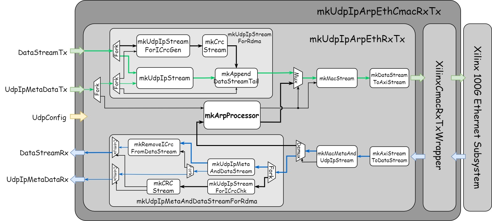
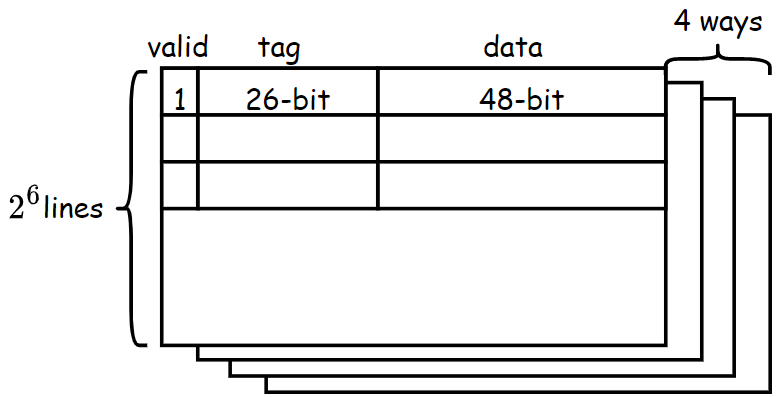
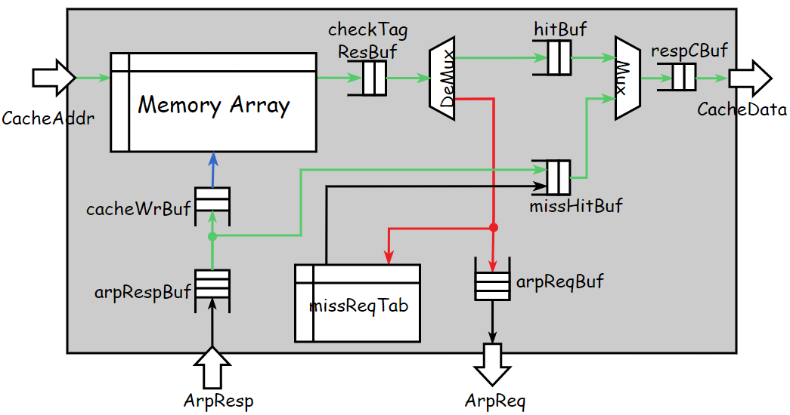
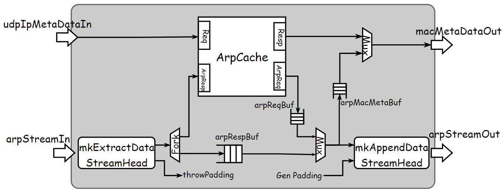
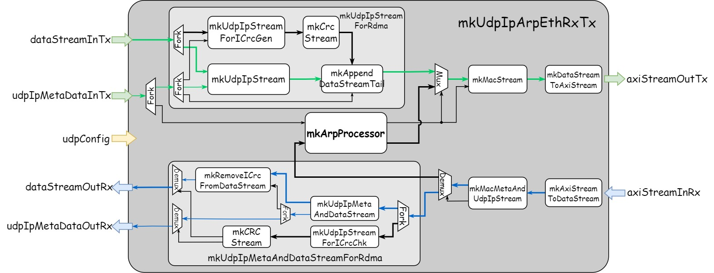
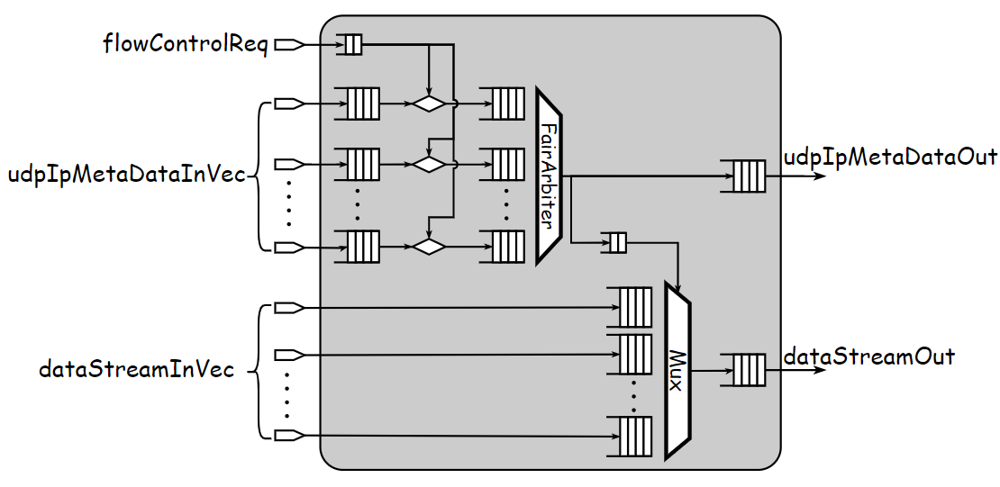
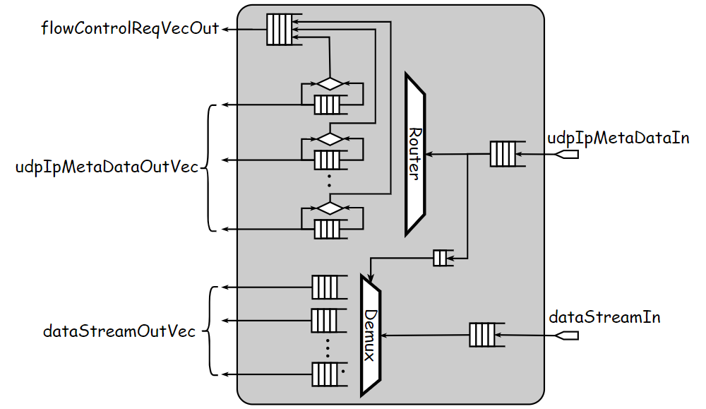

# Intro

This repo implements a collection of Ethernet-related components in Bluespec SystemVerilog(BSV) for high-performance packet processing on FPGA. Specifically, this repo provides modules for generating and parsing [UDP](https://en.wikipedia.org/wiki/User_Datagram_Protocol)/[IP](https://en.wikipedia.org/wiki/Internet_Protocol)/[Ethernet](https://en.wikipedia.org/wiki/Ethernet_frame) packets. An [ARP](https://en.wikipedia.org/wiki/Address_Resolution_Protocol) processing unit with non-blocking cache storing address information is also provided to handle MAC address resolution automatically. Beside building a standard UDP/IP/Ethernet stack, blue-ethernet adds support for RoCE(RDMA over Converged Ethernet): 1) integrate the generation and verification of ICRC(Invariant Cyclic Redundancy) in UDP/IP packet processing;  2) provide modules to handle PFC(Priority Flow Control) to realize the lossless network transmission. And finally interface conversion modules are also provided for packet generator and parser to interact with [Xilinx 100G Ethernet Subsystem](https://china.xilinx.com/products/intellectual-property/cmac_usplus.html)(CMAC).

<div align=center></div>

# Directories Overview

Some key directories of this repo are shown below:

```bash
├── lib               # external libraries/repos
│   ├── blue-crc      # high-performance CRC hardware implementation
│   └── blue-wrapper  # BSV wrappers for generating ready-to-use Verilog interface
├── scripts           # scripts used to build project
├── src               # design source files
│   └── includes      # files containing some commonly-used BSV types and modules
├── syn               # scripts for vivado synthesis and implementation
└── test              # source files for verification
    ├── bluesim       # testbenches based on bluesim
    ├── cocotb        # python testbenches based on cocotb
    └── vivado        # co-simulation with cmac using vivado
```

Here is a list of some critical source files:

```bash
./src
├── ArpCache.bsv               # Cache implementation storing MAC addresses got from ARP
├── ArpProcessor.bsv           # processing unit handling ARP requests and responses
├── includes                   
│   ├── CompletionBuf.bsv      
│   ├── ContentAddressMem.bsv  
│   ├── EthernetTypes.bsv      # numeric and struct types about protocol definition
│   ├── PortConversion.bsv     # interface conversion modules used to generate ready-to-use Verilog
│   ├── Ports.bsv              # numeric and struct types about in/output ports of modules
│   ├── RFile.bsv
│   ├── StreamHandler.bsv      # modules implemented for manipulating data stream
│   └── Utils.bsv              # utility functions and modules
├── MacLayer.bsv               # generator and parser for Ethernet packet
├── PfcUdpIpArpEthRxTx.bsv     # generator and parser for UDP/IP/Ethernet packet with PFC
├── PriorityFlowControl.bsv    # modules handling PFC
├── UdpIpArpEthRxTx.bsv        # generator and parser for UDP/IP/Ethernet packet 
├── UdpIpEthRx.bsv             # parser for UDP/IP/Ethernet packet
├── UdpIpEthTx.bsv             # generator for UDP/IP/Ethernet packet
├── UdpIpLayer.bsv             # parser and generator for UDP/IP packet
├── UdpIpLayerForRdma.bsv      # parser and generator for UDP/IP packet with support for RoCE
└── XilinxCmacRxTxWrapper.bsv  # bridge modules between parser/generator and Xilinx CMAC
```

# Components

This section provides detailed descriptions of some important components implemented in blue-ethernet, including their functionality, interface and hardware architecture.

## Stream Handler
What Ethernet-related hardware components do is basically a series of stream manipulations. The packet generator is responsible for inserting the header stream into the head of payload stream to generate complete packet stream. On the contrary, what the parser does is to extract the header stream and payload stream from packet stream. As for adding the checksum for a packet, the packet stream is passed into CRC calculator and then the output CRC value is appended to the tail of the packet stream.

The hardware entity corresponding to the stream we mention here is actually a group of data signals guarded by the valid-ready control signal pair. The valid signal indicates that  the source component wants to transfer data. And the ready indicates that the sink is ready to receive data from source. A transfer between source and sink only happens successfully when both valid and ready are high. If the size of data to be transmitted is larger than the size of one transfer, the data needs to be fragmented and transmitted in a series of transfers.

<div align=center></div>

The most tricky and error-prone part of stream processing is about how to handle the valid-ready control signals of different streams. In BSV, the manipulation of control signals is implemented by the compiler and invisible in the grammatical level, which helps designers focus on the logic of stream processing.

<details>
<summary>The stream processing modules provided in blue-ethernet include:</summary>

Data signals used to transfer packet stream between different components are encapsulated in **DataStream** struct, which includes 256-bit data signal, 32-bit byte-enable signal, two Boolean signals represents whether this transfer is the last or first of a packet stream.

```bluespec
typedef 256 DATA_BUS_WIDTH;
typedef TDiv#(DATA_BUS_WIDTH, 8) DATA_BUS_BYTE_WIDTH;
typedef Bit#(DATA_BUS_WIDTH) Data;
typedef Bit#(DATA_BUS_BYTE_WIDTH) ByteEn;
typedef struct {
    Data data;
    ByteEn byteEn;
    Bool isFirst;
    Bool isLast;
} DataStream deriving(Bits, Bounded, Eq, FShow);
```

- **mkAppendDataStreamHead** appends one transfer in **appendDataIn** stream to the head of one packet in **dataStreamIn** stream. The endian of data from these two streams can be swapped by setting **swapDataStream** and **swapAppendData** parameters. This module is used to combine header stream and payload stream to generate complete UDP/IP/Ethernet packet.

```bluespec
module mkAppendDataStreamHead#(
    IsSwapEndian swapDataStream,
    IsSwapEndian swapAppendData,
    PipeOut#(DataStream) dataStreamIn,
    PipeOut#(dType) appendDataIn
)(PipeOut#(DataStream));
```

- **mkAppendDataStreamTail** works similarly with **mkAppendDataStreamHead** by appending one transfer in **appendDataIn** stream to the tail of one packet in the **dataStreamIn** stream. To simplify internal hardware implementation, it also needs to take in one more stream **streamLengthIn** which carries the length of each packet in .

```bluespec
module mkAppendDataStreamTail#(
    IsSwapEndian swapDataStream,
    IsSwapEndian swapAppendData,
    PipeOut#(DataStream) dataStreamIn,
    PipeOut#(dType) appendDataIn,
    PipeOut#(Bit#(streamLenWidth)) streamLengthIn
)(PipeOut#(DataStream));
```

- **mkExtractDataStreamHead** extracts the head of one packet in **dataStreamIn** stream to **extractDataOut** stream and sends the remainder packet stream to **dataStreamOut** stream.

```bluespec
interface ExtractDataStream#(type dType);
    interface PipeOut#(dType) extractDataOut;
    interface PipeOut#(DataStream) dataStreamOut;
endinterface
module mkExtractDataStreamHead#(
    PipeOut#(DataStream) dataStreamIn
)(ExtractDataStream#(dType));
```

- **mkAxiStream512ToDataStream** converts 512-bit AXI-Stream interface required by Xilinx CMAC IP to 256- bit **DataStream** used in blue-ethernet.
- **mkDataStreamToAxiStream512** converts 256-bit **DataStream** used in blue-ethernet ****to 512-bit AXI-Stream required by Xilinx CMAC IP.

</details>


## UdpIpLayer

Modules in **UdpIpLayer** package are implemented for generating and parsing UDP/IP packet. 
<details>
<summary> Detailed Package Description: </summary>

The packet generator takes in **UdpIpMetaData** that contains UDP/IP header information and the stream of payload and outputs complete UDP/IP packet stream. The packet parser works in the opposite way by extracting **UdpIpMetaData** and payload stream from UDP/IP packet stream.

```bluespec
typedef struct {
    UdpLength  dataLen;   # The Length of payload data
    IpAddr     ipAddr;    # Desitnation IP address
    IpDscp     ipDscp;    # DSCP field used for PFC
    IpEcn      ipEcn;     # ECN field
    UdpPort    dstPort;   # Destination port number
    UdpPort    srcPort;   # Source port number
} UdpIpMetaData;
```

Signals encapsulated in **UdpIpMetaData** struct don’t cover all fields defined in UDP/IP header. Some fields of the header are fixed for a specific network device, which are encapsulated in **UdpConfig** struct and need to be configured before transmitting or receiving any packets. And some other fields are constant and hard-coded in hardware components.

```bluespec
typedef struct {
    EthMacAddr macAddr;  # Source MAC address
    IpAddr     ipAddr;   # Source IP address
    IpNetMask  netMask;  # IP netmask
    IpGateWay  gateWay;  # IP gateway
} UdpConfig;
```

- **mkUdpIpStream** generates UDP/IP packet stream by combining **udpIpMetaDataIn** carrying header infomation and **dataStreamIn** carrying payload stream. This module also takes in a function returning complete UDP/IP header, in which the value of constant fields of header are specified. The packet generation includes following steps: 1) generate UDP/IP header; 2) calculate and set the checksum field of IP header(the checksum of UDP header is unused in blue-ethernet); 3)insert the header at the head of payload stream.

```bluespec
module mkUdpIpStream#(
    UdpConfig udpConfig,
    PipeOut#(DataStream) dataStreamIn,
    PipeOut#(UdpIpMetaData) udpIpMetaDataIn,
    function UdpIpHeader genHeader(UdpIpMetaData meta, UdpConfig udpConfig, IpID ipId)
)(PipeOut#(DataStream));
```

- **mkUdpIpMetaDataAndDataStream** extracts **udpIpMetaDataOut** carrying header information and **dataStreamOut** carrying payload stream from input UDP/IP packet stream **udpIpStreamIn**. Before sending out extracted header and payload, the module needs to verify the integrity of received IP header by checksum field and throw them if the header is corrupted during transmission.

```bluespec
interface UdpIpMetaDataAndDataStream;
    interface PipeOut#(UdpIpMetaData) udpIpMetaDataOut;
    interface PipeOut#(DataStream) dataStreamOut;
endinterface
module mkUdpIpMetaDataAndDataStream#(
    UdpConfig udpConfig,
    PipeOut#(DataStream) udpIpStreamIn,
    function UdpIpMetaData extractMetaData(UdpIpHeader hdr)
)(UdpIpMetaDataAndDataStream);
```
</details>


## UdpIpLayerForRdma

Modules in **UdpIpLayerForRdma** package are implemented based on **UdpIpLayer** with support for RoCE(RDMA over Converged Ethernet). The additional functionality added to support RoCE is generation and verification of ICRC(Invariant CRC) required for RoCE packets. The format of RoCE packet is defined as below:

<div align=center></div>
<details>
<summary> Detailed Package Description: </summary>

- **mkUdpIpStreamForRdma** exposes the same interface and functionality as **mkUdpIpStream**. The main difference is that it appends an additional checksum to the tail of output packet stream to generate RoCE-compliant UDP/IP packet. To realize this functionality, another three components are integrated into the stream processing dataflow: (1) **mkUdpIpStreamForICrcGen** generates UDP/IP packet stream for CRC calculation by setting some fields of IP/UDP header and IB BTH to zero, which is required by the definition of ICRC; (2) **mkCrcStream** is provided in [blue-crc](https://github.com/datenlord/blue-crc) repo and used to calculate CRC checksum of packet stream; (3) **mkAppendDataStreamTail** appends CRC checksum to the tail of original UDP/IP packet stream;

<div align=center></div>

- **mkUdpIpMetaDataAndDataStreamForRdma** is implemented based on **mkUdpIpMetaDataAndDataStream** with additional support for ICRC verification. To realize this additional function, the input UDP/IP packet stream is sent to **mkUdpIpStreamForICrcChk** and then passed to **mkCrcStream** to get ICRC verification result. If verification fails, the extracted payload data and header are dropped. And before extracted payload stream is sent out, it needs to pass through **mkRemoveICrcFromDataStream** component to remove its tail ICRC checksum.

<div align=center></div>
</details>


## MacLayer

Modules in **MacLayer** package are implemented for generating and parsing Ethernet packet. The generator inserts Ethernet header to the head of UDP/IP packet stream to generate Ethernet packet stream. The parser extracts Ethernet header and UDP/IP packet stream from Ethernet packet stream.

<details>
<summary> Detailed Package Description:</summary>

The header information used to generate Ethernet packet is defined in **MacMetaData** struct.
```bluespec
typedef struct {
    EthMacAddr macAddr; # Destination MAC address
    EthType    ethType; # Type of Ethernet frame
} MacMetaData deriving(Bits, Eq, FShow);
```

To be noted, Ethernet packet handled in the **MacLayer** only covers fields outlined in the red rectangle in the figure below. Other fields are left to be processed by Xilinx CMAC IP.

<div align=center></div>

- **mkMacStream** generates Ethernet packet stream by combining **udpIpStreamIn** carrying UDP/IP packet stream and **macMetaDataIn** carrying Ethernet header information.

```bluespec
module mkMacStream#(
    PipeOut#(DataStream)  udpIpStreamIn,
    PipeOut#(MacMetaData) macMetaDataIn,
    UdpConfig udpConfig
)(PipeOut#(DataStream));
```

- **mkMacMetaDataAndUdpIpStream** extracts **macMetaDataOut** carrying Ethernet header infomation and **udpIpStreamOut** carrying UDP/IP packet stream from Ethernet packet stream **macStreamIn**.

```bluespec
interface MacMetaDataAndUdpIpStream;
    interface PipeOut#(MacMetaData) macMetaDataOut;
    interface PipeOut#(DataStream)  udpIpStreamOut;
endinterface

module mkMacMetaDataAndUdpIpStream#(
    PipeOut#(DataStream) macStreamIn,
    UdpConfig udpConfig
)(MacMetaDataAndUdpIpStream);
```
</details>


## ARP Processor

The Address Resolution Protocol (ARP) is used for discovering MAC address associated with a given IP address. In blue-ethernet, the module **mkArpProcessor** is implemented for ARP processing, which integrates ARP packet generator, parser and **mkArpCache** module storing MAC addresses.

<details>
<summary> Detailed Description of mkArpCache and mkArpProcessor:</summary>

### mkArpCache 
For cache used in ARP processing, 32-bit IP address  corresponds to cache address and 48-bit MAC address corresponds to cache data. The default arrangement of memory array for ARP cache is shown below, which is 4-way set-associative structure, each way contains 64 lines and each line includes 1-bit valid, 26-bit tag and 48-bit data. The total size of this default array configuration is about 1.2KB. It’s supported to change the size of memory array by setting the number of lines and ways. Based on this memory array, cache is designed to be non-blocking, support outstanding requests(multiple requests on flight) and use pseudo-LRU algorithm for cache line replacement.

<div align=center></div>

The interface definition and simplified structure diagram of **mkArpCache** module is shown below. The **ArpCache** has two subinterfaces: **cacheServer** handles interactions with components that MAC address resolution service; and **arpClient** handles interations with **mkArpProcessor** to initiate ARP request and get MAC address from ARP response. The basic workflow of **mkArpCache** module is as follows:

When cache receives a read request, it first searches the memory array to get all tags and data corresponding to the given IP address. Then it checks tags to see whether the data we need is stored in the cache. If cache hits, the fetched data is sent to **hitBuf**. Or the IP address is sent to **arpReqBuf** to initiate an ARP request. And when the ARP response comes back, the data and address information it carries is both written to **cacheWrBuf** and **missHitBuf** to update memory array and return cache read response.

```bluespec
interface ArpCache;
    interface Server#(CacheAddr, CacheData) cacheServer;
    interface Client#(CacheAddr,   ArpResp) arpClient;
endinterface
```

<div align=center></div>

The most difficult part of cache implementation is to support the feature of outstanding, that is supporting multiple read requests on flight. The problem induced by outstanding is that the response time is different for each on-flight ARP request, which means that a late request may receive its response first. So reorder mechanism is needed to guarantee correspondence between request address and response data when cache miss happens. To realize in-order response, the completion buffer **respCBuf** and content addressable memory **missReqTab** are integrated in the dataflow. The completion buffer works like FIFO with additional support for the functionality of reservation. Before actual enqueue operation, we can first reserves an order in the completion buffer. And dequeue operation follows the reserved order no matter the actual sequential order of enqueue operations. For each read request, a dequeue order is reversed in **respCBuf** once it’s received. And because of the ARP request can’t carry the order information, **missReqTab** is implemented to storing it.

### mkArpProcessor

The module can behave as both ARP client and server. As a server, processor needs to generate ARP request if MAC address of target IP is unknown and then waits for ARP response from the target device. As a client, ARP processor receives ARP request from other devices and sends back ARP response carrying its own MAC address.

<div align=center></div>

```bluespec
interface ArpProcessor;
    interface PipeOut#(DataStream) arpStreamOut;
    interface PipeOut#(MacMetaData) macMetaDataOut;
    interface Put#(UdpConfig) udpConfig;
endinterface

module mkArpProcessor#(
    PipeOut#(DataStream) arpStreamIn,
    PipeOut#(UdpIpMetaData) udpIpMetaDataIn
)(ArpProcessor);
```
</details>


## UdpIpEthRx

Modules in **UdpIpEthRx** package are implemented for receiving and parsing UDP/IP/Ethernet packets.

<details>
<summary> Detailed Package Description: </summary>

- **mkGenericUdpIpEthRx** extracts Ethernet header stream(**macMetaDataOut**), UDP/IP header stream(**udpIpMetaDataOut**) and payload stream(**dataStreamOut**) from **axiStreamIn** carrying Ethernet packet stream. It’s required to config the component through **udpConfig** interface first before receiving and parsing packets. And the module parameter **isSupportRdma** specifies whether or not it supports RoCE packet processing. The figure below shows the structure diagram of this module with support for RoCE enabled. If support for RoCE is disabled, the whole **mkUdpIpMetaDataAndDataStreamForRdma** module is replaced by **mkUdpIpMetaDataAndDataStream.**

```bluespec
interface UdpIpEthRx;
    interface Put#(UdpConfig) udpConfig;
    
    interface Put#(AxiStream512) axiStreamIn;
    
    interface PipeOut#(MacMetaData) macMetaDataOut;
    interface PipeOut#(UdpIpMetaData) udpIpMetaDataOut;
    interface PipeOut#(DataStream)  dataStreamOut;
endinterface

module mkGenericUdpIpEthRx#(Bool isSupportRdma)(UdpIpEthRx)
```

<div align=center></div>

- **mkGenericRawUdpIpEthRx** wraps **mkGenericUdpIpEthRx** using modules provided in [blue-wrapper](https://github.com/wengwz/blue-wrapper) to generate ready-to-use Verilog interface.
</details>


## UdpIpEthTx

Modules in **UdpIpEthTx** package are implemented for generating and transmitting UDP/IP/Ethernet packets.

<details>
<summary> Detailed Package Description: </summary>

- **mkGenericUdpIpEthTx** takes in Ethernet header stream(**macMetaDataOut**), UDP/IP header stream(**udpIpMetaDataOut**) and payload data stream(**dataStreamOut**), generates Ethernet packet stream and then sends it out through **axiStreamOut**. And the module parameter **isSupportRdma** specifies whether or not it supports RoCE packet processing. The figure below shows the structure of this module with support for RoCE enabled. 

```bluespec
interface UdpIpEthTx;
    interface Put#(UdpConfig) udpConfig;
    interface Put#(UdpIpMetaData) udpIpMetaDataIn;
    interface Put#(MacMetaData) macMetaDataIn;
    interface Put#(DataStream) dataStreamIn;
    interface AxiStream512PipeOut axiStreamOut;
endinterface

module mkGenericUdpIpEthTx#(Bool isSupportRdma)(UdpIpEthTx);
```

<div align=center></div>

- **mkGenericRawUdpIpEthTx**: this module wraps **mkGenericUdpIpEthTx** using modules provided in [blue-wrapper](https://github.com/wengwz/blue-wrapper) to generate ready-to-use Verilog interface.
</details>


## UdpIpArpEthRxTx
Modules provided in **UdpIpArpEthRxTx** package is designed to receive and transmit UDP/IP/Ethernet packets and handle ARP request and response at the same time.

<details>
<summary> Detailed Package Description: </summary>

#### mkGenericUdpIpArpEthRxTx
The module can be divided into two opposite paths of streams, including transmission path and reception path:

For transmission path, it takes in **dataStreamInTx** carrying payload stream and **udpIpMetaDataIn** carrying header information stream and generates **axiStreamOutTx** carring UDP/IP/Ethernet packet stream. There is no need to provides **MacMetaData** that contains Ethernet header information as **mkUdpIpEthTx** module, because **mkArpProcessor** is responsible for handling MAC address resolution and generating Ethernet header information. 

For the reception path, it works in the opposite way by extracting **dataStreamOutRx** carrying payload stream and **udpIpMetaDataOutRx** carrying header information stream from **axiStreamInRx** carrying UDP/IP/Ethernet packet stream. 

The Ethernet packet generator and parser are shared by both UDP/IP packet and ARP packet, so additional **Mux** and **Demux** are needed in the transmission and reception path for stream arbitration and distribution. The module parameter **isSupportRdma** specifies whether or not it supports RoCE packet processing. If support for RDMA is disabled, we only need **mkUdpIpStream** and **mkUdpIpMetaAndDataStream** in the transmision and reception path respectively.

```bluespec
interface UdpIpArpEthRxTx;
    interface Put#(UdpConfig)  udpConfig;
    // Tx
    interface Put#(UdpIpMetaData) udpIpMetaDataInTx;
    interface Put#(DataStream)    dataStreamInTx;
    interface AxiStream512PipeOut axiStreamOutTx;
    // Rx
    interface Put#(AxiStream512)   axiStreamInRx;
    interface PipeOut#(UdpIpMetaData) udpIpMetaDataOutRx;
    interface PipeOut#(DataStream)    dataStreamOutRx;
endinterface

module mkGenericUdpIpArpEthRxTx#(Bool isSupportRdma)(UdpIpArpEthRxTx);
```

<div align=center></div>

### mkGenericRawUdpIpArpEthRxTx
The module wraps **mkGenericUdpIpArpEthRxTx** using modules provided in [blue-wrapper](https://github.com/wengwz/blue-wrapper) so that it generates ready-to-use Verilog interface.

### mkUdpIpArpEthCmacRxTx
The module integrates both **mkGenericUdpIpArpEthRxTx** module and **mkXilinxCmacTxWrapper** module. It’s designed to interact with Xilinx CMAC IP to transmits and receives UDP/IP/Ethernet packets to and from physical medium.
</details>


## PriorityFlowControl

Modules in **PriorityFlowControl** package are implemented to realize mechanism of [priority flow control](https://en.wikipedia.org/wiki/Ethernet_flow_control) to ensure lossless network transmission.

<details>
<summary> Detailed Package Description: </summary>

- **mkPriorityFlowControlTx** takes in **dataStreamInVec** carrying eight channels of payload stream and **udpIpMetaDataInVec** carrying eight channels of header information, then performs arbitration over eight channels and outputs arbitraion result through **udpIpMetaDataOut** and **dataStreamOut**. The round robin arbitration strategy is adopted in this module to give all channels the same priority. This module is also responsible for pausing or resuming each channel according to flow control information from **flowControlReqVecIn**.

```bluespec
interface PriorityFlowControlTx;
    interface Get#(UdpIpMetaData) udpIpMetaDataOut;
    interface Get#(DataStream) dataStreamOut;
endinterface

module mkPriorityFlowControlTx#(
    PipeOut#(FlowControlReqVec) flowControlReqVecIn,
    Vector#(VIRTUAL_CHANNEL_NUM, DataStreamPipeOut) dataStreamInVec,
    Vector#(VIRTUAL_CHANNEL_NUM, UdpIpMetaDataPipeOut) udpIpMetaDataInVec
)(PriorityFlowControlTx);
```

<div align=center></div>

- **mkPriorityFlowControlRx** takes in **udpIpMetaDataIn** carrying header information stream and **dataStreamIn** carrying payload stream and then routes these two stream to their corresponding output channel specified by the channel index included in header information. Besides, this module needs to monitor the number of elements stored in the intermediate buffer of each channel. And when a channel’s buffer reaches its threshold, it sends out flow control request to pause packet transmission of this channel. The parameter **bufPacketNum** sets the maximum number of packets stored in the intermeidate buffer and **maxPacketFrameNum** sets the maximun number of frames in one packet. The width of each frame is 256-bit, equaling to the data width of intermediate buffer. The **pfcThreshold** sets the threshold number of packets stored in the buffer that triggers flow control request.

```bluespec
interface PriorityFlowControlRx#(
    numeric type bufPacketNum, 
    numeric type maxPacketFrameNum,
    numeric type pfcThreshold
);
    interface PipeOut#(FlowControlReqVec) flowControlReqVecOut;
    interface Vector#(VIRTUAL_CHANNEL_NUM, Get#(DataStream)) dataStreamOutVec;
    interface Vector#(VIRTUAL_CHANNEL_NUM, Get#(UdpIpMetaData)) udpIpMetaDataOutVec;
endinterface

module mkPriorityFlowControlRx#(
    DataStreamPipeOut dataStreamIn,
    UdpIpMetaDataPipeOut udpIpMetaDataIn
)(PriorityFlowControlRx#(bufPacketNum, maxPacketFrameNum, pfcThreshold));
```

<div align=center></div>
</details>


## PfcUdpIpArpEthRxTx

- **mkGenericPfcUdpIpArpEthRxTx** integrates **mkPriorityFlowControlRx/Tx** and **mkGenericUdpIpArpEthRxTx** to provide the functionality of generating and parsing UDP/IP/Ethernet packets while supporting priority flow control. For packet transmission, it takes eight channels of payload stream and UDP/IP header information, and outputs one UDP/IP/Ethernet packet stream. For packet reception, it takes in one UDP/IP/Ethernet packet stream and routes the extracted UDP/IP header and payload stream to one of eight output channels.

- **mkPfcUdpIpArpEthCmacRxTx** integrates both **mkGenericPfcUdpIpArpEthRxTx** module and **mkXilinxCmacTxWrapper** module. It’s designed to interact with Xilinx CMAC IP to transmits and receives UDP/IP/Ethernet packets to and from physical medium.

# Performance and Area

The synthesis and implementation of the main module **mkGenericUdpIpArpEthRxTx** are performed based on **Xilinx xcvu9p** device using Vivado. And results show that the circuit can reach the working frequency of 500MHz and provide the peak throughput of 128Gbps. The usage of hardware resources is listed as follows:

```bluespec
CLB Logic
+----------------------------+-------+-------+------------+-----------+-------+
|          Site Type         |  Used | Fixed | Prohibited | Available | Util% |
+----------------------------+-------+-------+------------+-----------+-------+
| CLB LUTs                   | 63886 |     0 |          0 |   1182240 |  5.40 |
|   LUT as Logic             | 41242 |     0 |          0 |   1182240 |  3.49 |
|   LUT as Memory            | 22644 |     0 |          0 |    591840 |  3.83 |
|     LUT as Distributed RAM | 22644 |     0 |            |           |       |
|     LUT as Shift Register  |     0 |     0 |            |           |       |
| CLB Registers              | 44099 |     0 |          0 |   2364480 |  1.87 |
|   Register as Flip Flop    | 44099 |     0 |          0 |   2364480 |  1.87 |
|   Register as Latch        |     0 |     0 |          0 |   2364480 |  0.00 |
| CARRY8                     |    73 |     0 |          0 |    147780 |  0.05 |
| F7 Muxes                   |   194 |     0 |          0 |    591120 |  0.03 |
| F8 Muxes                   |    28 |     0 |          0 |    295560 | <0.01 |
| F9 Muxes                   |     0 |     0 |          0 |    147780 |  0.00 |
+----------------------------+-------+-------+------------+-----------+-------+

BLOCKRAM
+-------------------+------+-------+------------+-----------+-------+
|     Site Type     | Used | Fixed | Prohibited | Available | Util% |
+-------------------+------+-------+------------+-----------+-------+
| Block RAM Tile    |  4.5 |     0 |          0 |      2160 |  0.21 |
|   RAMB36/FIFO*    |    4 |     0 |          0 |      2160 |  0.19 |
|     RAMB36E2 only |    4 |       |            |           |       |
|   RAMB18          |    1 |     0 |          0 |      4320 |  0.02 |
|     RAMB18E2 only |    1 |       |            |           |       |
| URAM              |    0 |     0 |          0 |       960 |  0.00 |
+-------------------+------+-------+------------+-----------+-------+
```

# Get Started

This section introduces how to get started with this project. Before any other steps, you first need to set up development environment referring to the script [setup.sh](./setup.sh). Here is a list of dependencies:

- [Bluespec Compiler](https://github.com/B-Lang-org/bsc)
- Docker
- Vivado
- Python packages: cocotb, cocotb-test, netifaces, scapy, cocotbext-axi
- Hardware Simulator: iverilog/verilator

After setting up the environment, clone this repo to a specific directory. Here we refer to this directory as BLUE_ETH:

```bash
git clone --recursive https://github.com/wengwz/blue-ethernet.git $(BLUE_ETH)
```

## Run Simulation

There are three different levels of testbenches provided in blue-ethernet:

- Unit Level: testbenches of this level are located in [$(BLUE_ETH)/test/bluesim](./test/bluesim) and provide functional verification of some important subcomponents, like ArpCache, CompletionBuf and AppendDataStreamTail. To launch simulation, you can follow commands below:

```bash
# Specify TARGET to the name of target component
cd $(BLUE_ETH)/test/bluesim
make TARGET=ArpCache
```

- System Level: testbenches of this level are located in [$(BLUE_ETH)/test/cocotb](./test/cocotb) and implemented in Python based on [cocotb](https://docs.cocotb.org/en/stable/) simulation platform. The functional verification of module **UdpIpEthRx** and **UdpIpEthTx** uses [scapy](https://github.com/secdev/scapy) to build reference model. And module **UdpIpArpEthRxTx** is tested over virtual network built from docker.

```bash
# Run tests of UdpIpEthRx/Tx
# Enable/Disable support for RDMA by setting SUPPORT_RDAM to True/False
cd $(BLUE_ETH)/test/cocotb
make cocotb TARGET=UdpIpEthTx SUPPORT_RDMA=TRUE

# Run simulation on virtual network
# Change NET_IFC in run_docker_net_test.sh to the name of your network card
cd $(BLUE_ETH)/test/cocotb
docker build -f ./build_docker/Dockerfile -t ethernet-test ./build_docker
./run_docker_net_test.sh
```

- Simulation with CMAC: The source files and scripts used to run co-simulation of implemented designs and Xilinx CMAC IP are provided in the directory [$(BLUE_ETH)/test/vivado](./test/vivado).

```bash
# Available TARGET includes UdpIpArpEthCmacRxTx/PfcUdpIpArpEthCmacRxTx
# Enable/Disable support for RDMA by setting SUPPORT_RDAM to True/False
cd $(BLUE_ETH)/test/vivado
make sim TARGET=UdpIpArpEthCmacRxTx SUPPORT_RDMA=False
```

## Run Synthesis and Implementation

Scripts used to run synthesis and implementation of designs are provided in the directory [$(BLUE_ETH)/syn](./syn). 

```bash
# TARGET specifies the top module to be synthsized or implemented
# SUPPORT_RDMA specifies whether modules supports RoCE packet processing
# ONLYSYNTH decides whether or not run implemetation after synthesis 
cd $(BLUE_ETH)/syn
make vivado TARGET=UdpIpArpEthRxTx SUPPORT_RDMA=False ONLYSYNTH=0
```

## Usage

- Verilog User: The BSV designs provided in this repo can generate Verilog codes to be integrated in other projects. Some modules has been wrapped with modules provided in [blue-wrapper](https://github.com/wengwz/blue-wrapper) to generate ready-to-use Verilog interface, including **mkRawUdpIpEthRx**, **mkRawUdpIpArpEthRxTx** and **mkRawUdpIpEthRx**. For other modules, you can also wrap them if needed. To generate Verilog codes, you can follow commands below and the generated codes are located in $(BLUE_ETH)/test/cocotb/verilog

```bash
# TARGET specifies the name of top module to be generated
# Specify SUPPORT_RDMA if needed
cd $(BLUE_ETH)/test/cocotb
make verilog TARGET=UdpIpEthTx SUPPORT_RDMA=TRUE
```

- BSV User: For designers using BSV, it’s more convenient to integrate modules provided in this repo into their own projects. Just import used package in your codes and add source file paths of this repo to compile options:

```bash
bsc -p +:$(BLUE_ETH)/src:$(BLUE_ETH)/src/includes ...
```

# Related Links

The implementation of blue-ethernet involves the usage of following external libraries:

- blue-crc: [https://github.com/datenlord/blue-crc.git](https://github.com/datenlord/blue-crc.git)
- blue-wrapper: [https://github.com/wengwz/blue-wrapper](https://github.com/wengwz/blue-wrapper)