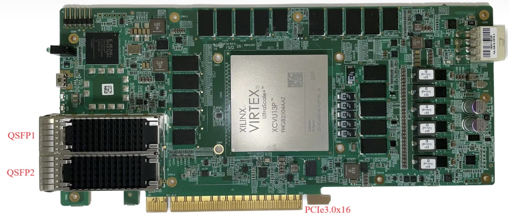

# FPGA On-board Project
This directory provides source files and scripts to build FPGA bitstream for on-board functionality and performance verification of hardware components implemented in this repo. In specific, this directory implements following hardware systems for performance and functionality verification of different components:

- XdmaLoopPerfTest: performance verification of [XDMA](https://www.xilinx.com/products/intellectual-property/pcie-dma.html);
- CmacPerfTest/CmacLoopPerfTest: functionality and performance verification of [CMAC](https://china.xilinx.com/products/intellectual-property/cmac_usplus.html);
- UdpCmacPerfTest/UdpCmacLoopPerfTest: performance verification of system composed of UDP processing uint and CMAC
- XdmaUdpCmacPerfTest: performance verification of the complete packet processing system composed of XDMA, UDP and CMAC;
- XdmaUdpCmac/XdmaUdpCmacLoop: functionality verification of complete packet processing system;

All hardware systems are implemented based on [Xilinx Vivado 2022.2](https://www.xilinx.com/support/download/index.html/content/xilinx/en/downloadNav/vivado-design-tools/2022-2.html). And the target hardware platform is [AliCloud FPGA acceleration card](https://zhuanlan.zhihu.com/p/617050950), which is equipped with [Xilinx Ultrascale+ xcvu13p](https://www.xilinx.com/products/silicon-devices/fpga/virtex-ultrascale-plus.html#productTable) FPGA device and two 100G ethernet ports. If you want to test these systems on other devices or boards, you may need to modify the the content of provided scripts, such as pin assignments and floorplan strategies.

The structure of this directory is shown as follows. For details of each hardware system, you may refer to the corresponding subdirectory.

```shell
./fpga/
├── common       # common source files and scripts
│   ├── bsv      # source codes in Bluespec System Verilog
│   ├── ips_tcl  # tcl scripts to generate Vivado IP
│   ├── software # control programs running on host PC
│   ├── tcl      # tcl scripts to run vivado flow
│   ├── verilog  # source codes in Verilog
│   └── xdc      # constraints for vivado flow
├── CmacLoopPerfTest
├── CmacPerfTest
├── UdpCmacLoopPerfTest
├── UdpCmacPerfTest
├── XdmaLoopPerfTest
├── XdmaUdpCmac
├── XdmaUdpCmacLoop
└── XdmaUdpCmacPerfTest
```
<div align=center></div>
